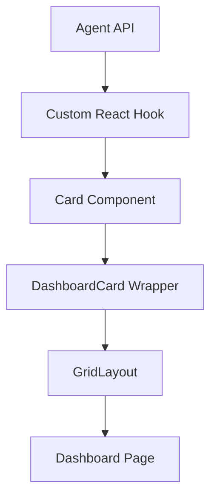

# Dashboard Component System

The dashboard is built from **self-contained React components** ("cards") rendered inside a flexible grid.

| Layer | File(s) | Responsibility |
|-------|---------|----------------|
| Page  | `src/app/dashboard/page.tsx` | Declares which cards appear and their order/size. |
| Layout | `src/components/dashboard/GridLayout.tsx` | Responsive CSS grid (swap for drag-and-drop library later). |
| Wrapper | `src/components/dashboard/DashboardCard.tsx` | Shared chrome, sizing, loading skeleton, footer. |
| Cards | `src/components/dashboard/cards/*` | Eight domain-specific UI widgets (Matchup, Batting, Pitching, etc.). |

## Data flow

1. A thin React **hook** under `src/lib/hooks/` fetches data from the **agent API** (see `src/agent/index.ts`).
2. Each card calls its hook and renders the result inside `<DashboardCard>`.
3. The page composes cards via `<GridLayout>`.

## Key agent methods
(Defined in `src/agent/index.ts`, documented in `docs/agent/api.md`)

- `getCurrentMatchup()`
- `getTeamStats()`
- `getLineupIssues()`
- `getWaiverWire()`
- `getPlayerNews()`
- `getNextWeekPreview()`
- `getRecentActivity()`

_Note: stubs exist today; they will be filled in as data integration progresses._

## Adding a new card

1. Create `NewCard.tsx` in `cards/` that returns `<DashboardCard title="..." icon={IconComponent}>…`.
2. Add the card to `dashboardCards` array in `page.tsx` with desired `size`.
3. Write a hook -> agent method if new data is required.

**Icon Usage**: Cards use the `icon` prop which expects a react-icons component (not emoji). See the "Icon System" section in `docs/design-system.md` for guidelines on choosing appropriate icons from Game Icons (`react-icons/gi`) for baseball-specific graphics or Feather Icons (`react-icons/fi`) for general UI elements.

---
For UI guidelines (colors, typography) see `docs/design-system.md`. For agent integration details start with `docs/agent/README.md`. 