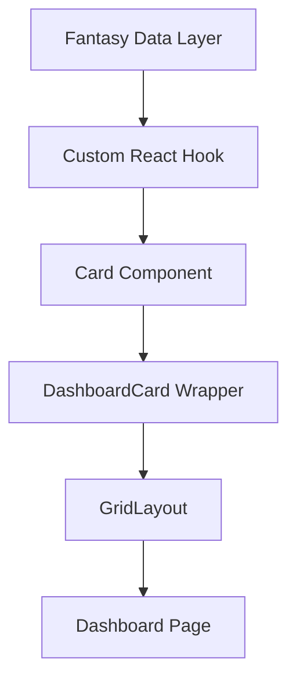

# Dashboard Component System

The dashboard is built from **self-contained React components** ("cards") rendered inside a flexible grid.

| Layer | File(s) | Responsibility |
|-------|---------|----------------|
| Page  | `src/app/dashboard/page.tsx` | Declares which cards appear and their order/size. |
| Layout | `src/components/dashboard/GridLayout.tsx` | Responsive CSS grid (swap for drag-and-drop library later). |
| Wrapper | `src/components/dashboard/DashboardCard.tsx` | Shared chrome, sizing, loading skeleton, footer. |
| Cards | `src/components/dashboard/cards/*` | Domain-specific UI widgets (Lineup Issues, Matchup Projection, Opponent Status, Waivers, etc.). |

## Data flow

1. A thin React **hook** under `src/lib/hooks/` fetches data from the **fantasy data layer** (see `src/lib/fantasy/`).
2. Each card calls its hook and renders the result inside `<DashboardCard>`.
3. The page composes cards via `<GridLayout>`.

## Key data layer functions
(Defined in `src/lib/fantasy/`, documented in `docs/data-architecture.md`)

- `getCurrentMLBGameKey()` — current season info
- `analyzeUserFantasyLeagues()` — league/team discovery
- `getStatCategories()` / `getStatCategoryMap()` — stat metadata
- `enrichStats()` — add metadata to raw Yahoo stats
- `getEnrichedLeagueStatCategories()` — league-specific scored categories

## The dashboard grammar

Both mode dashboards render the same three rows, mode-native content in each — the shape is shared so features can't drift (a new element must declare its row and both columns):

| Row | Categories | Points |
|---|---|---|
| **1. Matchup marquee** — "am I winning, what's the lever" | `BossCard` (live category tally, caps, Boss Brief) | `PointsMarquee` (live score, projected finals via `usePointsOpponentWeek`, points brief from `lib/points/brief.ts`) |
| **2. Top action** — one priced move, routes to /streaming | `TopStreamTile` (slot-aware #1 batter stream via `useTopWeekStream`) | `TopWeekMoveTile` (week-moves board #1) |
| **3. Reference grid** — the shared cards | `GridLayout` of the both-mode cards + projection cards | `GridLayout` of the both-mode cards |

Roster-construction content (suggested moves lists, VOR holds/drops) deliberately does NOT appear on either dashboard — that's /roster's job; row 2 names ONE action and routes.

**Two gating axes** (see docs/ui-patterns.md#the-mode-axis-categories--points): scoring `mode` picks the dashboard; `headToHead` (from `useActiveLeague`, orthogonal — Yahoo 'roto'/'point' leagues have no weekly opponent) gates every opponent-shaped element inside it.

| Card | Mode | H2H-only | Why |
|---|---|---|---|
| `LineupIssuesCard` | both | no | Roster status + today's slate — no scoring semantics. |
| `PlayerUpdatesCard` | both | no | Roster injury/news — no scoring semantics. |
| `OpponentStatusCard` | both | **yes** | Opponent injuries + probables — needs a weekly opponent. |
| `WaiversCard` | both | no | Waiver priority + pending claims + FA pool. |
| `RecentActivityCard` | both | no | League transactions. |
| `BossCard` | categories | **yes** | L7 Boss Brief over live matchup margins. |
| `SeasonComparisonCard` / `NextWeekCard` | categories | **yes** | Both are `MatchupProjectionCard` — opponent projections. |
| `TopStreamTile` / `TopWeekMoveTile` | categories / points | no | Streaming value exists with or without an opponent. |
| `PointsMarquee` | points | internal | Renders the season variant (projected week + standing) itself when `!headToHead`. |

Both-mode cards are mounted by BOTH `DashboardModeRouter` (categories) and `PointsDashboard` — adding one means adding it in both places.

## Adding a new card

1. Create `NewCard.tsx` in `cards/` that returns `<DashboardCard title="..." icon={IconComponent}>…`.
2. Classify it on the mode axis (table above) and mount it on the dashboard(s) it belongs to.
3. Write a hook -> data layer function if new data is required.

**Icon Usage**: Cards use the `icon` prop which expects a react-icons component (not emoji). See the "Icon System" section in `docs/design-system.md` for guidelines on choosing appropriate icons from Game Icons (`react-icons/gi`) for baseball-specific graphics or Feather Icons (`react-icons/fi`) for general UI elements.

---
For UI guidelines (colors, typography) see `docs/design-system.md`. For data layer details see `docs/data-architecture.md`. 