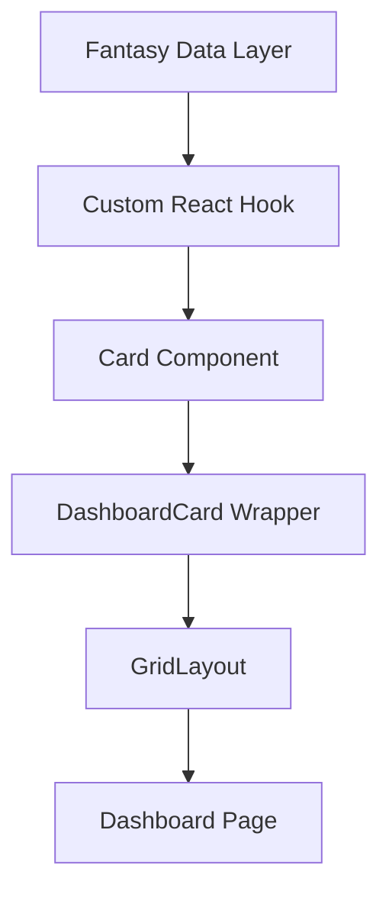

# Dashboard Component System

The dashboard is built from **self-contained React components** ("cards") rendered inside a flexible grid.

| Layer | File(s) | Responsibility |
|-------|---------|----------------|
| Page  | `src/app/dashboard/page.tsx` | Declares which cards appear and their order/size. |
| Layout | `src/components/dashboard/GridLayout.tsx` | Responsive CSS grid (swap for drag-and-drop library later). |
| Wrapper | `src/components/dashboard/DashboardCard.tsx` | Shared chrome, sizing, loading skeleton, footer. |
| Cards | `src/components/dashboard/cards/*` | Domain-specific UI widgets (Lineup Issues, Matchup Projection, Opponent Status, Waivers, etc.). |

## Data flow

1. A thin React **hook** under `src/lib/hooks/` fetches data from the **fantasy data layer** (see `src/lib/fantasy/`).
2. Each card calls its hook and renders the result inside `<DashboardCard>`.
3. The page composes cards via `<GridLayout>`.

## Key data layer functions
(Defined in `src/lib/fantasy/`, documented in `docs/data-architecture.md`)

- `getCurrentMLBGameKey()` — current season info
- `analyzeUserFantasyLeagues()` — league/team discovery
- `getStatCategories()` / `getStatCategoryMap()` — stat metadata
- `enrichStats()` — add metadata to raw Yahoo stats
- `getEnrichedLeagueStatCategories()` — league-specific scored categories

## The mode axis: which cards render on which dashboard

`DashboardModeRouter` picks the dashboard by the active league's scoring mode; `FantasyProvider` resolves the ACTIVE league's keys (switcher selection, primary fallback), so one card implementation serves both. Classify every card per the mode-axis rule (docs/ui-patterns.md#the-mode-axis-categories--points):

| Card | Mode | Why |
|---|---|---|
| `LineupIssuesCard` | both | Roster status + today's slate — no scoring semantics. |
| `PlayerUpdatesCard` | both | Roster injury/news — no scoring semantics. |
| `OpponentStatusCard` | both (H2H) | Opponent injuries + probables off the scoreboard — works for any head-to-head league. |
| `WaiversCard` | both | Waiver priority + pending claims + FA pool. |
| `RecentActivityCard` | both | League transactions. |
| `BossCard` | categories | L7 Boss Brief over category margins. |
| `SeasonComparisonCard` / `NextWeekCard` | categories | Both are `MatchupProjectionCard` (current/next week) — per-category projections. |
| `TopWeekMoveTile`, week outlook, `SuggestedMovesPanel`, roster value | points | Native points units (pts/wk, VOR). |

Both-mode cards are mounted by BOTH `DashboardModeRouter` (categories grid) and `PointsDashboard` (below the points marquee) — adding one means adding it in both places.

## Adding a new card

1. Create `NewCard.tsx` in `cards/` that returns `<DashboardCard title="..." icon={IconComponent}>…`.
2. Classify it on the mode axis (table above) and mount it on the dashboard(s) it belongs to.
3. Write a hook -> data layer function if new data is required.

**Icon Usage**: Cards use the `icon` prop which expects a react-icons component (not emoji). See the "Icon System" section in `docs/design-system.md` for guidelines on choosing appropriate icons from Game Icons (`react-icons/gi`) for baseball-specific graphics or Feather Icons (`react-icons/fi`) for general UI elements.

---
For UI guidelines (colors, typography) see `docs/design-system.md`. For data layer details see `docs/data-architecture.md`. 