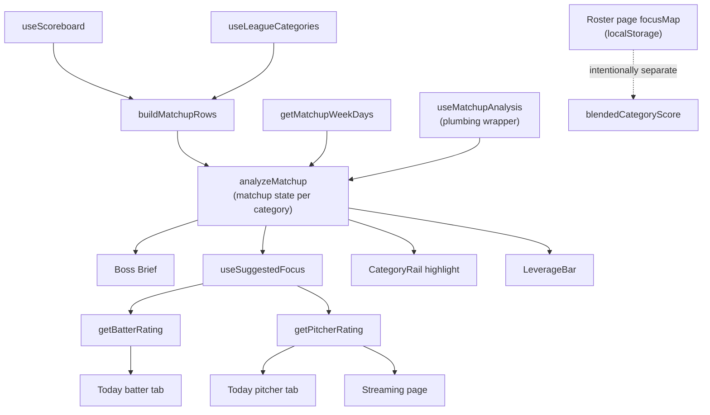

## Matchup State (L5) — the recommendation system

The reference for HOW the app turns matchup state into user-facing advice — "Chase X", "Cruising in Y", "Coin-flip week", focus bar defaults, the rail's "chase me" highlight, and the leverage bar fill. Read this before adding a new advice surface, before tuning a category-priority threshold, or before writing a second function that decides "which categories matter this week".

For the player-level layer (how good is THIS player) see [unified-rating-model.md](./unified-rating-model.md). This file covers the matchup layer (L5) that sits on top of those ratings. For the ROS roster-strategy analog (L6 — talent vs the league in a matchup vacuum, same `focusMap` vocabulary), see [roster-strategy.md](./roster-strategy.md).

## The two layers

The app evaluates fantasy decisions at two distinct levels. Different concepts, different docs, different engines.

| Layer | Question it answers | Canonical engine | Doc |
|-------|---------------------|------------------|-----|
| Player rating | "How good is THIS player against THIS matchup?" | `getBatterRating`, `getPitcherRating`, `blendedCategoryScore` | [unified-rating-model.md](./unified-rating-model.md) |
| Matchup recommendation | "Which CATEGORIES should I be fighting for this week?" | `analyzeMatchup` | this file |

Mixing the layers is a category error. A "great" batter rating doesn't tell the user whether they need more runs; a "chase HR" recommendation doesn't tell them which OF to play. The two layers connect through `focusMap`: `analyzeMatchup` recommends per-category focus, and the rating engines weight their per-category sub-scores by that focus. That's the only connection — the recommendation layer never re-implements rating math.

## Single source of truth: `analyzeMatchup`

[src/lib/matchup/analysis.ts](../src/lib/matchup/analysis.ts) is the only place that decides what the matchup state implies for each category. Every advice surface that picks categories or assigns chase/punt MUST consume `MatchupAnalysis`. No exceptions.

This is a hard rule because we already learned the cost of breaking it: Boss Brief used to roll its own category picker (`pickWinningCats` / `pickLosingCats` + a hardcoded `if winning ≥2 batter cats AND losing HR/SB/R/RBI then chase` rule), which produced "Chase SB" while the focus bar above showed SB as `neutral`. The user saw two engines disagreeing about the same category in the same view. Don't let that happen again.

If you need a new signal that doesn't exist on `MatchupAnalysis` today, extend the engine. Don't compute it locally and don't add a parallel category picker.

## Direction-aware focus + projection swing

The `chase / neutral / punt` vocabulary is sign-aware on the analyzed margin. The previous rule used `|margin|` only, which produced "chase everything" on the streaming page when many corrected margins clustered near zero — a slim lead and a slim deficit both looked like chases.

Current rule (in `suggestFocus`):

```text
|margin| ≥ LOCKED_THRESHOLD (0.7) → punt    (locked win OR out-of-reach loss)
margin ≤ 0                         → chase   (losing or tied — the pickup target)
0 < margin < LOCKED_THRESHOLD      → neutral (winning but not locked — "hold")
no signal                          → neutral
```

Both extremes are `punt` because both deserve 0× weight: a locked win doesn't need help, a hopeless loss can't be saved this week. Direction splits the non-locked zone — slight leads "hold" (1× weight, protect what you have) and slight deficits / tossups "chase" (2× weight, aggressive pickup).

When a corrected (matchup-to-date + projection) analysis is available, each row also carries:

| Field | Meaning |
|-------|---------|
| `margin` | Corrected end-of-week margin (used for `suggestedFocus`) |
| `rawMargin` | Matchup-to-date margin (where the scoreboard reads today). Undefined in the Sunday `targetWeek: 'next'` pivot — no MTD baseline exists to swing from |
| `swing` | `margin - rawMargin` — positive = projection improves your standing. Undefined in the Sunday pivot |

`suggestedFocus` is computed from the corrected `margin`, so trajectory is captured automatically: if you're currently losing but projected to flip, the corrected margin is positive and the focus is `neutral` (your roster handles it — don't waste a stream slot). If you're currently winning but projected to lose, the corrected margin is negative and the focus is `chase` (act now, the lead is melting).

**Stream capacity (2026-07):** for pitcher counting cats (K/W/QS/IP) a losing corrected margin is computed on the gap **net of what the remaining moves budget could add via streams** (capped at even — reachability, never a projected lead; rows softened this way carry `streamAssisted` and the Game Plan tile reads "in reach via streams"). Without this the loop is circular: the current-roster projection says "out of reach" → auto-concede zeroes the pivotality weight → the streaming board stops valuing the very cats streaming would win, while the Boss Brief simultaneously says "stream N to catch up". Mechanics + per-stream yields: `AnalyzeOpts.streamCapacity` in [matchup/analysis.ts](../src/lib/matchup/analysis.ts) and `LEAGUE_AVG_START_OUTPUT` in [projection/streamPitcherCatImpact.ts](../src/lib/projection/streamPitcherCatImpact.ts). Deliberately my-side-only (no opponent threat model) and counting-cats-only (volume can't reliably fix ERA/WHIP; batter adds displace).

The `rawMargin` and `swing` fields are exposed for UI explanation ("currently losing but projected to win this") — they don't change the focus call. **Counting pitcher cats** (K, W, QS, IP) get the same projection treatment as batter cats; **ERA and WHIP** also blend (IP-weighted recovery from the scoreboard); **K/9, BB/9, H/9** pass through `composeCorrectedRows` unchanged so for those `rawMargin === margin` and `swing === 0`. The asymmetry is by design — see [streaming-page.md](./streaming-page.md#pitcher-k9--bb9--h9-are-matchup-to-date-only) for the rationale.

## Two analyses, one engine

| Hook | Rows analyzed | Use it for |
|------|---------------|------------|
| `useMatchupAnalysis` | Matchup-to-date scoreboard rows | Descriptive surfaces — Boss Brief, LeverageBar, CategoryRail. They report current state, not future state |
| `useCorrectedMatchupAnalysis` | MTD + rest-of-week projection on both sides (batter cats + counting/ratio pitcher cats), or **pure projection** when `targetWeek: 'next'` for the Sunday streaming pivot | Action surfaces — Today / Streaming Game Plan. The projection answers "which categories will be contested by Sunday given my actual roster?" better than the scoreboard alone |

Both flow through the same `analyzeMatchup` engine, so the `chase / neutral / punt` vocabulary and direction-aware rule are identical. The difference is only the input rows.

`useCorrectedMatchupAnalysis` runs four projections in parallel (my+opp × batter+pitcher counting cats) and merges them into one corrected row set. K/9 / BB/9 / H/9 aren't separately projected and pass through unchanged in blend mode (the per-FA `scorePitcher` per-start view carries the rate-cat fidelity). On the end-of-week `targetWeek: 'next'` pivot, `composeCorrectedRows` runs in `'projection-only'` mode — every projectable row gets its pure-projection value, un-projectable rows fall to em-dash and are filtered out of consuming panels. See [streaming-page.md](./streaming-page.md#end-of-week-pivot) for the full rationale.

## Architecture



## Engine catalog

| Engine | Lives in | Inputs | Outputs |
|--------|----------|--------|---------|
| `analyzeMatchup` | [src/lib/matchup/analysis.ts](../src/lib/matchup/analysis.ts) | `MatchupRow[]`, `daysElapsed`, optional `mode: 'raw' \| 'corrected'` (default `'raw'`) | Per-row `margin` ∈ [-1, +1], `priority`, `suggestedFocus`; aggregate `leverage`, `contestedCount`, `lockedCount`. `mode='corrected'` swaps the counting-stat denominator — see Thresholds |
| `withSwing` | [src/lib/matchup/analysis.ts](../src/lib/matchup/analysis.ts) | corrected `MatchupAnalysis`, raw `MatchupAnalysis` | Same shape as the corrected analysis but each row gets `rawMargin` + `swing = margin - rawMargin` for UI explanation. Focus suggestions are unchanged |
| `useMatchupAnalysis` | [src/lib/hooks/useMatchupAnalysis.ts](../src/lib/hooks/useMatchupAnalysis.ts) | `leagueKey`, `teamKey` | `{ analysis, isLoading }` — wraps scoreboard + categories + week-progress assembly. Use for descriptive surfaces |
| `useCorrectedMatchupAnalysis` | [src/lib/hooks/useCorrectedMatchupAnalysis.ts](../src/lib/hooks/useCorrectedMatchupAnalysis.ts) | `leagueKey`, `teamKey`, optional `opts: { targetWeek: 'current' \| 'next' }` | `{ analysis, isCorrected, isLoading, myProjection, oppProjection, myPitcherProjection, oppPitcherProjection, opponentTeamKey, opponentName }` — same as raw but rows carry projection-corrected `margin` + `rawMargin` + `swing` for batter cats and counting/ratio pitcher cats (mid-week blend mode). On `targetWeek: 'next'` the end-of-week streaming pivot kicks in: pure-projection values via `composeCorrectedRows` projection-only mode, no `withSwing` (so `rawMargin`/`swing` are undefined). Use for action surfaces (Game Plan card). See [streaming-page.md](./streaming-page.md#end-of-week-pivot) |
| `useSuggestedFocus` | [src/lib/hooks/useSuggestedFocus.ts](../src/lib/hooks/useSuggestedFocus.ts) | `MatchupAnalysis`, `(statId) => boolean` predicate | `{ focusMap, suggestedFocusMap, toggle, reset, hasOverrides }` — analysis-driven defaults plus user override layer |
| `getBossBrief` | [src/lib/dashboard/bossBrief.ts](../src/lib/dashboard/bossBrief.ts) | `MatchupAnalysis`, probables, league limits, used IP/GS | One-line tactical narrative with optional CTA |
| `LineupIssuesCard` rules | [src/components/dashboard/cards/LineupIssuesCard.tsx](../src/components/dashboard/cards/LineupIssuesCard.tsx) | Roster + lineup state | Health / eligibility / IL-slot issues. Orthogonal to matchup state — these rules answer "is your lineup mechanically broken", not "what should you chase" |

The rating engines (`getBatterRating`, `getPitcherRating`, `blendedCategoryScore`) are documented separately in [unified-rating-model.md](./unified-rating-model.md). They consume `focusMap` produced by this layer; they do not produce category recommendations.

## UI surface map

| Surface | Component | Engine read | Notes |
|---------|-----------|-------------|-------|
| Boss Brief one-liner | [BossCard/BossBrief.tsx](../src/components/dashboard/BossCard/BossBrief.tsx) | `getBossBrief` | Picks "cruising in" cats from locked wins, "chase" cats from contested losses |
| Leverage bar | [BossCard/LeverageBar.tsx](../src/components/dashboard/BossCard/LeverageBar.tsx) | `analysis.leverage` | Magnitude-aware bar fill |
| Category rail tiles | [BossCard/CategoryRail.tsx](../src/components/dashboard/BossCard/CategoryRail.tsx) | Yahoo W/L per row | Color-codes raw win/loss |
| Category rail highlight dot | [BossCard/index.tsx](../src/components/dashboard/BossCard/index.tsx) computes, rail renders | `analysis.rows` priority | "Most contested losing cat" — same priority signal that powers `chase` suggestions |
| Today batter focus bar | [LineupManager.tsx](../src/components/lineup/LineupManager.tsx) → [GamePlanPanel.tsx](../src/components/shared/GamePlanPanel.tsx) | `useCorrectedMatchupAnalysis` → `useSuggestedFocus` over batter cats | Direction-aware on corrected margin; user overrides via per-tile segmented control. Section placement uses the always-jump rule from [`focusPanel`](../src/components/shared/focusPanel.tsx) — same chrome shared with Streaming and Roster |
| Today pitcher focus bar | [TodayPitchers.tsx](../src/components/lineup/TodayPitchers.tsx) → [GamePlanPanel.tsx](../src/components/shared/GamePlanPanel.tsx) | `useCorrectedMatchupAnalysis` → `useSuggestedFocus` over pitcher cats | Same hook and section chrome as the batter focus bar, scoped to pitcher categories |
| Streaming Game Plan (batter + pitcher) | [StreamingManager.tsx](../src/components/streaming/StreamingManager.tsx) → [GamePlanPanel.tsx](../src/components/shared/GamePlanPanel.tsx) with `side` prop | `useCorrectedMatchupAnalysis` → `useSuggestedFocus` per side | Same `GamePlanPanel` consumed on Lineup, sharing [`focusPanel`](../src/components/shared/focusPanel.tsx) chrome with the Roster page |

## Thresholds

All recommendation-layer thresholds live in [src/lib/matchup/analysis.ts](../src/lib/matchup/analysis.ts). If you change one, search the codebase to make sure no UI is hardcoding a duplicate.

| Constant | Value | What it controls |
|----------|-------|------------------|
| `LOCKED_THRESHOLD` | `0.7` | `\|margin\|` ≥ this → `suggestedFocus = punt` (locked either way) |
| `RATE_SCALE` | per-stat table | Typical-swing scale per rate stat (AVG 0.040, ERA 0.50, etc.). Margin = `gap × dir / scale × confidence` where `confidence = 0.15 + 0.85 × weekProgress`. Applies in both `mode='raw'` and `mode='corrected'` |
| `CORRECTED_COUNTING_SCALE` | per-stat-id table | Fixed residual-uncertainty scale for counting cats when `mode='corrected'`. Margin = `gap × dir / scale` (no confidence factor — the projection already absorbs week progress). Keyed by `stat_id` because batter K (21) and pitcher K (42) share a display label |

### The `mode` option

`analyzeMatchup` takes `mode: 'raw' | 'corrected'` (default `'raw'`). The two modes differ only in how counting-stat margins are computed; rate-stat math is identical.

| Mode | Counting-stat denominator | Right for |
|------|---------------------------|-----------|
| `raw` | Dynamic `expectedRemaining = (my + opp) / weekProgress × (1 − weekProgress)` — the pace-extrapolated production still to come | Matchup-to-date scoreboard rows (Boss Brief, dashboard LeverageBar, raw analysis in `useCorrectedMatchupAnalysis`) |
| `corrected` | Fixed `CORRECTED_COUNTING_SCALE[statId]` — residual uncertainty around the end-of-week projection | Rows that already carry rest-of-week projection (Game Plan via `useCorrectedMatchupAnalysis`) |

Only `useCorrectedMatchupAnalysis` ever passes `mode: 'corrected'`, and only on the *corrected* `analyzeMatchup` call (the parallel raw call inside the same hook stays `'raw'` so `withSwing` can compare a like-for-like matchup-to-date baseline). The Sunday pivot path runs `mode: 'corrected'` and skips the raw call entirely — there is no MTD baseline to swing from.

**Why the two-mode split exists.** The original engine used the dynamic `expectedRemaining` denominator for both MTD and corrected inputs. That works fine for MTD — "down 10 with most of the week to play" should read as a slim margin, not locked. But once the projection has baked rest-of-week production into the corrected totals, dividing by another remaining-production buffer double-counts and compresses every gap toward zero. The user-visible failure mode was Game Plan saying "chase H" while the corrected projection had the user down 25 hits at end of week — clearly out of reach, but never crossing the `|margin| ≥ 0.7` threshold. The fixed scale is the same shape as `RATE_SCALE` (which already handles rate stats this way because they have no meaningful "remaining production" buffer either).

`suggestedFocus` falls out of `LOCKED_THRESHOLD` regardless of mode:

```text
|margin| ≥ 0.7              → punt   (locked win OR out-of-reach loss)
margin ≤ 0 (with signal)    → chase  (losing or tied — pickup target)
0 < margin < 0.7            → neutral (winning, not locked — hold)
no signal                   → neutral
```

There's no separate "contested" magnitude band. Direction is the gate — once the corrected margin is non-locked, sign decides chase vs. hold. The previous magnitude band (`CONTESTED_THRESHOLD`, scaled by week progress) created the "chase everything" failure mode by treating slim leads and slim deficits identically. Confidence is still encoded in the margin itself via the `0.15 + 0.85 × weekProgress` factor inside `computeMargin`, so an early-week 5-3 lead in HR doesn't read as locked.

A row has "no signal" when either (a) the two sides are not a comparable numeric pair (`rowHasComparablePair(row)` is false — one or both values missing / non-numeric, typical for ERA/WHIP when 0 IP) or (b) both sides parse as exactly zero (the Monday-morning pattern: counting stats are reported as `0=0` before any games complete). Without rule (b), every counting cat would land in `chase` on Monday since `|0| < CONTESTED_THRESHOLD`, making the rate cats look like they were "demoted" by the engine when they're actually the only ones being correctly handled. Aggregates (`leverage`, `contestedCount`, `lockedCount`) skip no-signal rows on the same logic — a flat 0=0 matchup should read as flat, not as fully contested. (Headline W/L/T uses `countsTowardRecord` on `MatchupRow` instead — see `buildMatchupRows` — so one-sided categories can count in the Boss tally without inventing a recommendation margin from "5 vs —" or "3.50 vs —".)

The same vocabulary (`chase | neutral | punt`) is what `getBatterRating` and `getPitcherRating` consume via `focusMap`. Punt = 0 weight, chase = 2× weight, neutral = 1× weight (renormalized). See [unified-rating-model.md](./unified-rating-model.md).

## Intentional divergence: roster-page focus

The roster page ([src/components/roster/RosterManager.tsx](../src/components/roster/RosterManager.tsx)) intentionally does NOT consume `analyzeMatchup`. Its `focusMap` is persisted in localStorage and reflects the user's ROS category strategy. The reasoning:

- Today / Streaming answer **"what should I do today / this week?"** — analyzeMatchup with day-aware or week-aware inputs is the right source.
- Roster answers **"how is my roster's talent shaped vs the league, in a matchup vacuum?"** — a single hot week shouldn't move the needle, and neither should this week's schedule. Source is `computeLeagueForecast` on talent-only neutral-week aggregates. See [roster-strategy.md](./roster-strategy.md).

Same vocabulary, same focusMap shape, different defaults. By design. Both paths feed the same rating engines so the math is consistent; only the source of the focus picks differs.

If you find yourself wanting to merge them, push back. They're decisions on different time horizons and conflating them weakens both.

**UI chrome is shared, engine state isn't.** [`RosterFocusPanel`](../src/components/roster/RosterFocusPanel.tsx) and [`GamePlanPanel`](../src/components/shared/GamePlanPanel.tsx) both render the same chase/hold/punt sections, segmented controls, and reset button by consuming [`focusPanel`](../src/components/shared/focusPanel.tsx). They differ in tile content (forecast rank/z-score vs matchup margin) and in suggestion source (forward focus planner vs `analyzeMatchup`), but section placement, override semantics, and visual grammar are unified.

## Rules for adding a new advice surface

1. **Read from `MatchupAnalysis`.** Use `useMatchupAnalysis(leagueKey, teamKey)` if you're in a component, or accept a `MatchupAnalysis` prop if you're a pure helper.
2. **Don't pick categories with new logic.** "What's the closest losing cat" / "what's most locked" / "what's contested" — they're already on `analysis.rows` as `priority`, `margin`, `suggestedFocus`. Sort and slice.
3. **Don't introduce parallel thresholds.** If you need a different cutoff, prove the existing ones won't work, then change `analyze.ts` constants and update everyone at once. Threshold drift is the bug we're explicitly defending against.
4. **Domain-specific rules are OK if they're clearly orthogonal.** Boss Brief's "ERA/WHIP bleeding with starts left" and "Pitching volume competition" rules are examples — they're structural problems with specific corrective actions (stream a safe arm / add volume), not generic "lose by margin X" claims. Document why a domain rule isn't replaceable by analysis priority before keeping it.
5. **Update this doc and the UI surface map** when you add the surface.

## Known cross-surface co-existence rules

These are deliberate and not bugs. Documented so they're not "fixed" by accident.

- **Yahoo W/L coloring vs analysis-driven highlight.** The category rail tiles are colored by Yahoo's raw W/L; the highlight dot uses `analysis.priority`. The colors say "are you winning or losing?", the dot says "which one is most worth fighting for?" Both signals, different questions.
- **Category fit thresholds in pitcher breakdown.** [src/lib/pitching/display.tsx](../src/lib/pitching/display.tsx) `categoryFit` uses 0.65 / 0.40 to color the per-stat strips inside the pitcher score breakdown. These are display thresholds for sub-scores within `getPitcherRating`, not category-recommendation thresholds. They live in the rating layer; touching them does not touch this layer.
