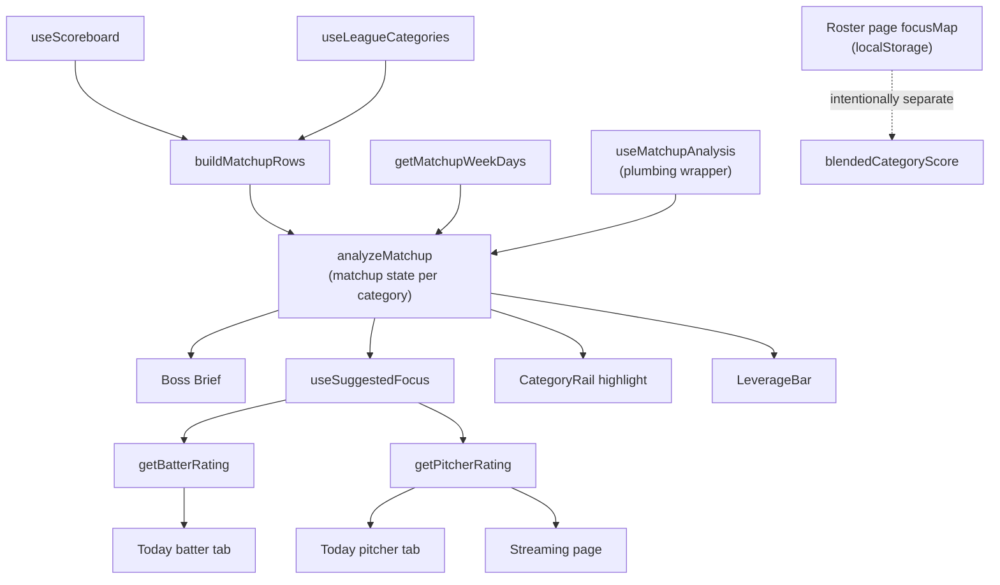

# Recommendation System

This is the reference for HOW the app turns matchup state into user-facing advice — "Chase X", "Cruising in Y", "Coin-flip week", focus bar defaults, the rail's "chase me" highlight, and the leverage bar fill. Read this before adding a new advice surface, before tuning a category-priority threshold, or before writing a second function that decides "which categories matter this week".

For the player-level layer (how good is THIS player) see [scoring-conventions.md](./scoring-conventions.md). This file covers the matchup layer that sits on top of those ratings.

## The two layers

The app evaluates fantasy decisions at two distinct levels. Different concepts, different docs, different engines.

| Layer | Question it answers | Canonical engine | Doc |
|-------|---------------------|------------------|-----|
| Player rating | "How good is THIS player against THIS matchup?" | `getBatterRating`, `getPitcherRating`, `blendedCategoryScore` | [scoring-conventions.md](./scoring-conventions.md) |
| Matchup recommendation | "Which CATEGORIES should I be fighting for this week?" | `analyzeMatchup` | this file |

Mixing the layers is a category error. A "great" batter rating doesn't tell the user whether they need more runs; a "chase HR" recommendation doesn't tell them which OF to play. The two layers connect through `focusMap`: `analyzeMatchup` recommends per-category focus, and the rating engines weight their per-category sub-scores by that focus. That's the only connection — the recommendation layer never re-implements rating math.

## Single source of truth: `analyzeMatchup`

[src/lib/matchup/analysis.ts](../src/lib/matchup/analysis.ts) is the only place that decides what the matchup state implies for each category. Every advice surface that picks categories or assigns chase/punt MUST consume `MatchupAnalysis`. No exceptions.

This is a hard rule because we already learned the cost of breaking it: Boss Brief used to roll its own category picker (`pickWinningCats` / `pickLosingCats` + a hardcoded `if winning ≥2 batter cats AND losing HR/SB/R/RBI then chase` rule), which produced "Chase SB" while the focus bar above showed SB as `neutral`. The user saw two engines disagreeing about the same category in the same view. Don't let that happen again.

If you need a new signal that doesn't exist on `MatchupAnalysis` today, extend the engine. Don't compute it locally and don't add a parallel category picker.

## Direction-aware focus + projection swing

The `chase / neutral / punt` vocabulary is sign-aware on the analyzed margin. The previous rule used `|margin|` only, which produced "chase everything" on the streaming page when many corrected margins clustered near zero — a slim lead and a slim deficit both looked like chases.

Current rule (in `suggestFocus`):

```text
|margin| ≥ LOCKED_THRESHOLD (0.7) → punt    (locked win OR out-of-reach loss)
margin ≤ 0                         → chase   (losing or tied — the pickup target)
0 < margin < LOCKED_THRESHOLD      → neutral (winning but not locked — "hold")
no signal                          → neutral
```

Both extremes are `punt` because both deserve 0× weight: a locked win doesn't need help, a hopeless loss can't be saved this week. Direction splits the non-locked zone — slight leads "hold" (1× weight, protect what you have) and slight deficits / tossups "chase" (2× weight, aggressive pickup).

When a corrected (YTD + projection) analysis is available, each row also carries:

| Field | Meaning |
|-------|---------|
| `margin` | Corrected end-of-week margin (used for `suggestedFocus`) |
| `rawMargin` | YTD-only margin (where the scoreboard reads today) |
| `swing` | `margin - rawMargin` — positive = projection improves your standing |

`suggestedFocus` is computed from the corrected `margin`, so trajectory is captured automatically: if you're currently losing but projected to flip, the corrected margin is positive and the focus is `neutral` (your roster handles it — don't waste a stream slot). If you're currently winning but projected to lose, the corrected margin is negative and the focus is `chase` (act now, the lead is melting).

The `rawMargin` and `swing` fields are exposed for UI explanation ("currently losing but projected to win this") — they don't change the focus call. **Counting pitcher cats** (K, W, QS, IP) get the same projection treatment as batter cats; **ratio pitcher cats** (ERA, WHIP, K/9 etc.) pass through `composeCorrectedRows` unchanged, so for those `rawMargin === margin` and `swing === 0`. The asymmetry is by design — see [streaming-page.md "Ratio cats are YTD only"](./streaming-page.md#ratio-cats-are-ytd-only) for the rationale.

## Two analyses, one engine

| Hook | Rows analyzed | Use it for |
|------|---------------|------------|
| `useMatchupAnalysis` | YTD scoreboard rows | Descriptive surfaces — Boss Brief, LeverageBar, CategoryRail. They report current state, not future state |
| `useCorrectedMatchupAnalysis` | YTD + rest-of-week projection on both sides (batter cats + counting pitcher cats) | Action surfaces — Today / Streaming Game Plan. The projection answers "which categories will be contested by Sunday given my actual roster?" better than YTD alone |

Both flow through the same `analyzeMatchup` engine, so the `chase / neutral / punt` vocabulary and direction-aware rule are identical. The difference is only the input rows.

`useCorrectedMatchupAnalysis` runs four projections in parallel (my+opp × batter+pitcher counting cats) and merges them into one corrected row set. Ratio pitcher cats (ERA, WHIP, K/9) pass through YTD because rate blending requires recovering YTD IP from the scoreboard and the failure mode is silent — the design call is to keep ratio fidelity at the per-FA `scorePitcher` per-start view (where the user reads "this guy will torch my WHIP" as a per-start pill). See [streaming-page.md](./streaming-page.md#ratio-cats-are-ytd-only) for the full rationale.

## Architecture



## Engine catalog

| Engine | Lives in | Inputs | Outputs |
|--------|----------|--------|---------|
| `analyzeMatchup` | [src/lib/matchup/analysis.ts](../src/lib/matchup/analysis.ts) | `MatchupRow[]`, `daysElapsed` | Per-row `margin` ∈ [-1, +1], `priority`, `suggestedFocus`; aggregate `leverage`, `contestedCount`, `lockedCount` |
| `withSwing` | [src/lib/matchup/analysis.ts](../src/lib/matchup/analysis.ts) | corrected `MatchupAnalysis`, raw `MatchupAnalysis` | Same shape as the corrected analysis but each row gets `rawMargin` + `swing = margin - rawMargin` for UI explanation. Focus suggestions are unchanged |
| `useMatchupAnalysis` | [src/lib/hooks/useMatchupAnalysis.ts](../src/lib/hooks/useMatchupAnalysis.ts) | `leagueKey`, `teamKey` | `{ analysis, isLoading }` — wraps scoreboard + categories + week-progress assembly. Use for descriptive surfaces |
| `useCorrectedMatchupAnalysis` | [src/lib/hooks/useCorrectedMatchupAnalysis.ts](../src/lib/hooks/useCorrectedMatchupAnalysis.ts) | `leagueKey`, `teamKey` | `{ analysis, isCorrected, isLoading, myProjection, oppProjection, myPitcherProjection, oppPitcherProjection }` — same as raw but rows carry projection-corrected `margin` + `rawMargin` + `swing` for batter cats and counting pitcher cats. Use for action surfaces (Game Plan card) |
| `useSuggestedFocus` | [src/lib/hooks/useSuggestedFocus.ts](../src/lib/hooks/useSuggestedFocus.ts) | `MatchupAnalysis`, `(statId) => boolean` predicate | `{ focusMap, suggestedFocusMap, toggle, reset, hasOverrides }` — analysis-driven defaults plus user override layer |
| `getBossBrief` | [src/lib/dashboard/bossBrief.ts](../src/lib/dashboard/bossBrief.ts) | `MatchupAnalysis`, probables, league limits, used IP/GS | One-line tactical narrative with optional CTA |
| `LineupIssuesCard` rules | [src/components/dashboard/cards/LineupIssuesCard.tsx](../src/components/dashboard/cards/LineupIssuesCard.tsx) | Roster + lineup state | Health / eligibility / IL-slot issues. Orthogonal to matchup state — these rules answer "is your lineup mechanically broken", not "what should you chase" |

The rating engines (`getBatterRating`, `getPitcherRating`, `blendedCategoryScore`) are documented separately in [scoring-conventions.md](./scoring-conventions.md). They consume `focusMap` produced by this layer; they do not produce category recommendations.

## UI surface map

| Surface | Component | Engine read | Notes |
|---------|-----------|-------------|-------|
| Boss Brief one-liner | [BossCard/BossBrief.tsx](../src/components/dashboard/BossCard/BossBrief.tsx) | `getBossBrief` | Picks "cruising in" cats from locked wins, "chase" cats from contested losses |
| Leverage bar | [BossCard/LeverageBar.tsx](../src/components/dashboard/BossCard/LeverageBar.tsx) | `analysis.leverage` | Magnitude-aware bar fill |
| Category rail tiles | [BossCard/CategoryRail.tsx](../src/components/dashboard/BossCard/CategoryRail.tsx) | Yahoo W/L per row | Color-codes raw win/loss |
| Category rail highlight dot | [BossCard/index.tsx](../src/components/dashboard/BossCard/index.tsx) computes, rail renders | `analysis.rows` priority | "Most contested losing cat" — same priority signal that powers `chase` suggestions |
| Today batter focus bar | [LineupManager.tsx](../src/components/lineup/LineupManager.tsx) | `useCorrectedMatchupAnalysis` → `useSuggestedFocus` over batter cats | Direction-aware on corrected margin; user overrides via pill toggle (still uses standalone `CategoryFocusBar` here) |
| Today pitcher focus bar | [TodayPitchers.tsx](../src/components/lineup/TodayPitchers.tsx) | `useMatchupAnalysis` → `useSuggestedFocus` over pitcher cats | Today page hasn't migrated to the corrected pitcher analysis yet; still uses raw |
| Streaming Game Plan (batter + pitcher) | [StreamingManager.tsx](../src/components/streaming/StreamingManager.tsx) → [GamePlanPanel.tsx](../src/components/streaming/GamePlanPanel.tsx) with `side` prop | `useCorrectedMatchupAnalysis` → `useSuggestedFocus` per side | Inline `RowFocusPill` is the leftmost cell on each row — same chase/punt/neutral toggle as the standalone bar, just embedded. Replaces both the old `CategoryFocusBar` and `MatchupPulse` panels on the streaming page |
| Matchup pulse tiles (dashboard only) | [shared/MatchupPulse.tsx](../src/components/shared/MatchupPulse.tsx) | Raw W/L | Informational. Still used on the dashboard alongside the leverage bar (different questions: "how many cats" vs "how solid is the lead"). Retired from the streaming page — Game Plan subsumed both |

## Thresholds

All recommendation-layer thresholds live in [src/lib/matchup/analysis.ts](../src/lib/matchup/analysis.ts). If you change one, search the codebase to make sure no UI is hardcoding a duplicate.

| Constant | Value | What it controls |
|----------|-------|------------------|
| `LOCKED_THRESHOLD` | `0.7` | `\|margin\|` ≥ this → `suggestedFocus = punt` (locked either way) |
| `RATE_SCALE` | per-stat table | Typical-swing scale per rate stat (AVG 0.040, ERA 0.50, etc.). Margin = `gap × dir / scale × confidence` where `confidence = 0.15 + 0.85 × weekProgress` |

`suggestedFocus` falls out of those thresholds:

```text
|margin| ≥ 0.7              → punt   (locked win OR out-of-reach loss)
margin ≤ 0 (with signal)    → chase  (losing or tied — pickup target)
0 < margin < 0.7            → neutral (winning, not locked — hold)
no signal                   → neutral
```

There's no separate "contested" magnitude band. Direction is the gate — once the corrected margin is non-locked, sign decides chase vs. hold. The previous magnitude band (`CONTESTED_THRESHOLD`, scaled by week progress) created the "chase everything" failure mode by treating slim leads and slim deficits identically. Confidence is still encoded in the margin itself via the `0.15 + 0.85 × weekProgress` factor inside `computeMargin`, so an early-week 5-3 lead in HR doesn't read as locked.

A row has "no signal" when either (a) Yahoo omitted the value (`hasData = false` — typical for ERA/WHIP/AVG when 0 IP / 0 AB) or (b) both sides are exactly zero (the Monday-morning pattern: counting stats are reported as `0=0` before any games complete). Without rule (b), every counting cat would land in `chase` on Monday since `|0| < CONTESTED_THRESHOLD`, making the rate cats look like they were "demoted" by the engine when they're actually the only ones being correctly handled. Aggregates (`leverage`, `contestedCount`, `lockedCount`) skip no-signal rows on the same logic — a flat 0=0 matchup should read as flat, not as fully contested.

The same vocabulary (`chase | neutral | punt`) is what `getBatterRating` and `getPitcherRating` consume via `focusMap`. Punt = 0 weight, chase = 2× weight, neutral = 1× weight (renormalized). See [scoring-conventions.md](./scoring-conventions.md).

## Intentional divergence: roster-page focus

The roster page ([src/components/roster/RosterManager.tsx](../src/components/roster/RosterManager.tsx)) intentionally does NOT consume `analyzeMatchup`. Its `focusMap` is persisted in localStorage and reflects the user's season-long category strategy. The reasoning:

- Today / Streaming answer **"what should I do this week?"** — analyzeMatchup is the right input.
- Roster answers **"which players are worth holding all season?"** — a single hot week shouldn't move the needle.

Same vocabulary, same focusMap shape, different defaults. By design. Both paths feed the same rating engines so the math is consistent; only the source of the focus picks differs.

If you find yourself wanting to merge them, push back. They're decisions on different time horizons and conflating them weakens both.

## Rules for adding a new advice surface

1. **Read from `MatchupAnalysis`.** Use `useMatchupAnalysis(leagueKey, teamKey)` if you're in a component, or accept a `MatchupAnalysis` prop if you're a pure helper.
2. **Don't pick categories with new logic.** "What's the closest losing cat" / "what's most locked" / "what's contested" — they're already on `analysis.rows` as `priority`, `margin`, `suggestedFocus`. Sort and slice.
3. **Don't introduce parallel thresholds.** If you need a different cutoff, prove the existing ones won't work, then change `analyze.ts` constants and update everyone at once. Threshold drift is the bug we're explicitly defending against.
4. **Domain-specific rules are OK if they're clearly orthogonal.** Boss Brief's "ERA/WHIP bleeding with starts left" rule is one — it's a structural problem with a specific corrective action (stream a safe arm), not a generic "lose by margin X" claim. Document why a domain rule isn't replaceable by analysis priority before keeping it.
5. **Update this doc and the UI surface map** when you add the surface.

## Known cross-surface co-existence rules

These are deliberate and not bugs. Documented so they're not "fixed" by accident.

- **MatchupPulse vs LeverageBar (dashboard only).** Pulse shows raw W/L tiles; leverage bar shows margin-weighted fill. Both can be on the dashboard — they answer different questions. Don't try to make the leverage bar agree with raw W/L counts. (The streaming page used to render MatchupPulse too; it was retired in favor of the Game Plan card, which provides both signals in one panel.)
- **Yahoo W/L coloring vs analysis-driven highlight.** The category rail tiles are colored by Yahoo's raw W/L; the highlight dot uses `analysis.priority`. The colors say "are you winning or losing?", the dot says "which one is most worth fighting for?" Both signals, different questions.
- **Category fit thresholds in pitcher breakdown.** [src/lib/pitching/display.tsx](../src/lib/pitching/display.tsx) `categoryFit` uses 0.65 / 0.40 to color the per-stat strips inside the pitcher score breakdown. These are display thresholds for sub-scores within `getPitcherRating`, not category-recommendation thresholds. They live in the rating layer; touching them does not touch this layer.
